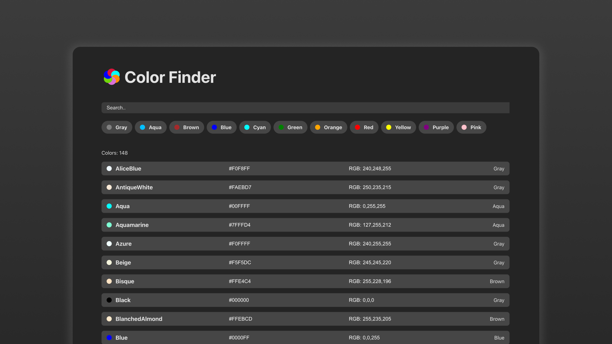

# Color Finder



## Features

- **Search Functionality**: Users can search for colors by name.
- **Group Filtering**: Filter colors by predefined groups (e.g., red, blue, green).
- **Responsive Design**: The application is fully responsive and adapts to different screen sizes.
- **Copy to Clipboard**: Users can copy color codes (HEX or RGB) with a single click, with a tooltip indicating success.
- **Dynamic Views**: Toggle between "list" and "card" views for displaying colors.

## Technologies Used

- **React**: For building the user interface.
- **TypeScript**: For type safety and better developer experience.
- **Vite**: For fast development and build processes.
- **PostCSS**: For advanced CSS features and preprocessing.
- **Nanostores**: For lightweight state management.
- **Axios**: For fetching data from the API.

## Project Structure

The project is organized into the following key modules:

- **Search Header**: Includes a search input and group filter buttons.
- **Color List**: Displays the list of colors in either "list" or "card" view.
- **List Item**: Represents individual color items with options to copy HEX or RGB values.
- **State Management**: Uses Nanostores for managing search terms, selected groups, and filtered data.

## How to Run the Project

1. Clone the repository:
   ```bash
   git clone https://github.com/your-username/color-finder.git
   cd color-finder